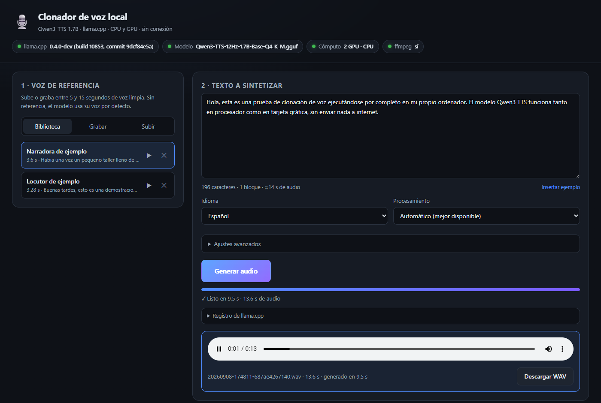
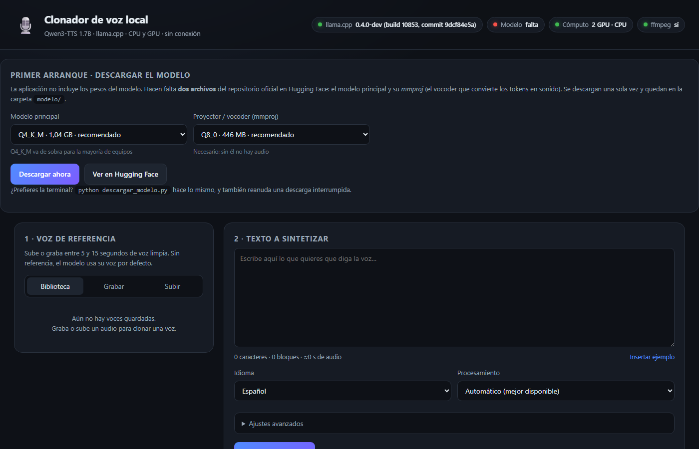
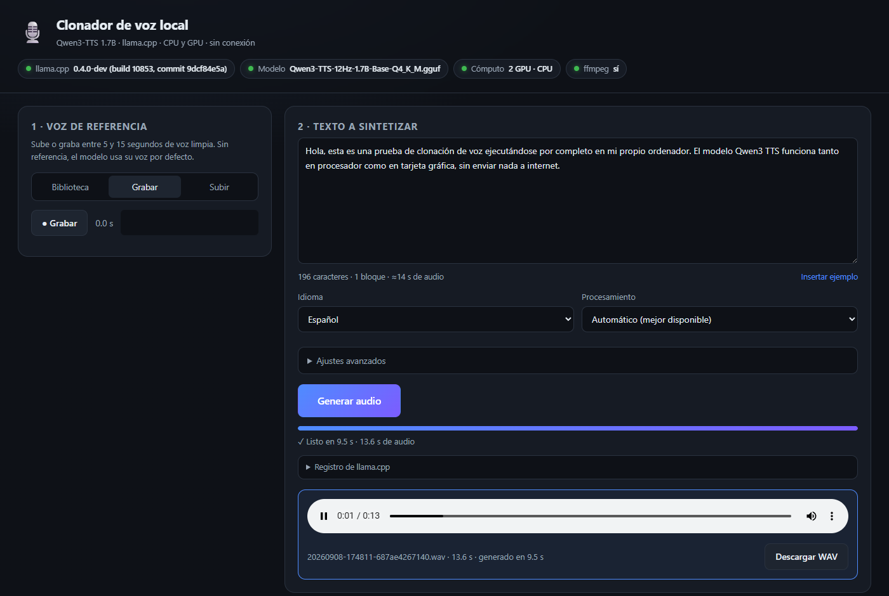
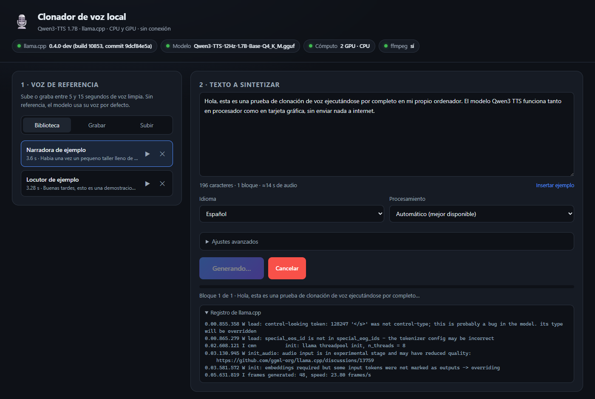
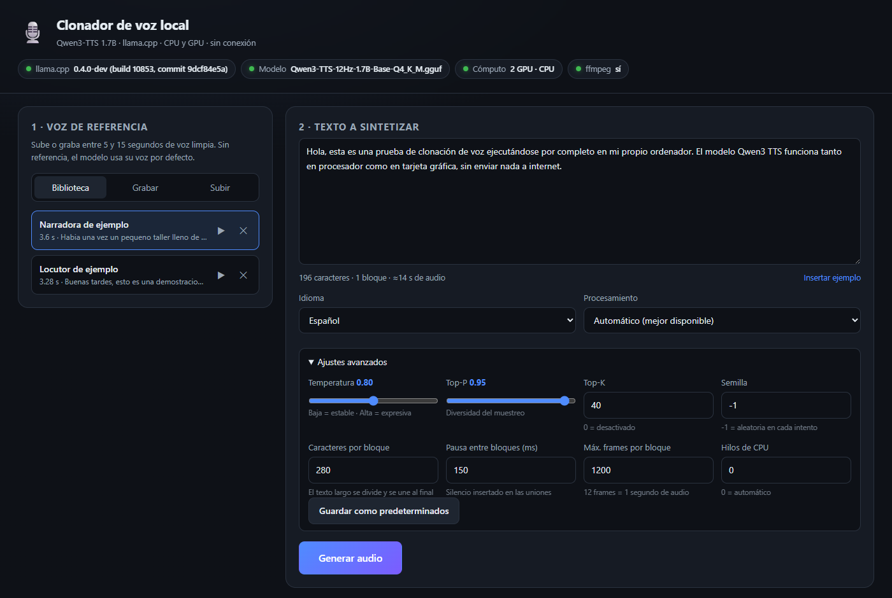

<h1 align="center">🎙️ Clonar voz</h1>

<p align="center">
  Clonación de voz y texto a voz <b>100 % local</b>, con interfaz web.<br>
  Funciona igual en <b>CPU</b> que en <b>GPU</b>. Nada sale de tu ordenador.
</p>

<p align="center">
  
  
  
  
</p>

<p align="center">
  
</p>

---

Graba o sube **10 segundos** de una voz, escribe un texto y obtén ese texto
hablado con esa misma voz. Todo el proceso ocurre en tu máquina: no hay API, no
hay cuenta, no hay subida de audio a ningún servidor.

Por debajo usa el modelo [**Qwen3-TTS-12Hz-1.7B**](https://huggingface.co/ggml-org/Qwen3-TTS-12Hz-1.7B-Base-GGUF)
en formato GGUF, ejecutado con [**llama.cpp**](https://github.com/ggml-org/llama.cpp).

### Qué trae

- 🎤 **Clonación por muestra** — graba desde el navegador o sube un archivo
- 🌍 **10 idiomas** — español, inglés, chino, alemán, italiano, portugués, japonés, coreano, francés y ruso
- ⚡ **CPU y GPU** — elige el modo en cada generación; detecta y prioriza la GPU dedicada
- 📚 **Biblioteca de voces** — guarda las voces y reutilízalas
- 📄 **Textos largos** — se trocean por frases, se sintetizan y se unen solos
- 📊 **Progreso en vivo** — barra, bloque actual y el registro de llama.cpp
- 💾 **Historial** — todo lo generado queda con reproductor y descarga
- 🔒 **Sin conexión** — tras la instalación funciona con el wifi apagado

---

## 📦 Instalación paso a paso

> Los pesos del modelo (~1,5 GB) **no vienen en el repositorio**.
> La aplicación los descarga en el primer arranque.

### Paso 1 — Instalar Python 3.10 o superior

Descárgalo de [python.org/downloads](https://www.python.org/downloads/).

> ⚠️ **En Windows, marca la casilla «Add python.exe to PATH»** durante la
> instalación. Es el fallo más común.

Comprueba que quedó bien:

```bash
python --version
```

### Paso 2 — Instalar llama.cpp

Es el motor que ejecuta el modelo. **Hace falta la build b10500 o superior**:
el soporte de Qwen3-TTS se añadió en agosto de 2026 y las versiones anteriores
no sirven.

**Windows**

```bash
winget install ggml.llamacpp
```

**macOS**

```bash
brew install llama.cpp
```

**Linux** — descarga un binario de las
[releases oficiales](https://github.com/ggml-org/llama.cpp/releases) o compílalo.

Comprueba la versión:

```bash
llama-tts --version
```

### Paso 3 — Instalar ffmpeg

Convierte el audio de referencia al formato que espera el modelo. Sin él solo
podrás subir `.wav` y `.mp3`, y la grabación desde el navegador no funcionará.

```bash
winget install Gyan.FFmpeg
```

<sub>macOS: <code>brew install ffmpeg</code> · Linux: <code>sudo apt install ffmpeg</code></sub>

### Paso 4 — Descargar este repositorio

```bash
git clone https://github.com/jceronch1/Clonar-voz.git
cd Clonar-voz
```

<sub>Sin git: botón verde <b>Code → Download ZIP</b> y descomprime.</sub>

### Paso 5 — Arrancar

**Windows** — doble clic en **`iniciar.bat`**

**Linux / macOS**

```bash
chmod +x iniciar.sh && ./iniciar.sh
```

El lanzador instala las dependencias de Python, comprueba llama.cpp y te ofrece
descargar el modelo. Cuando termine, abre <http://127.0.0.1:8080>.

### Paso 6 — Descargar el modelo

Si no lo hiciste en el paso anterior, la web te recibe con este panel:

<p align="center">
  
</p>

Elige la cuantización y pulsa **Descargar ahora**. Son dos archivos:

| Archivo | Tamaño | Para qué |
|---|---|---|
| `Qwen3-TTS-12Hz-1.7B-Base-Q4_K_M.gguf` | 1,04 GB | genera los tokens de audio |
| `mmproj-Qwen3-TTS-12Hz-1.7B-Base-Q8_0.gguf` | 446 MB | vocoder: convierte esos tokens en sonido |

**Hacen falta los dos.** La descarga es reanudable y verifica el SHA-256 al
terminar. Desde la terminal es lo mismo:

```bash
python descargar_modelo.py
```

```bash
python descargar_modelo.py --modelo Q8_0 --mmproj bf16
```

---

## ▶️ Cómo se usa

### 1. Elige una voz

<p align="center">
  
</p>

Graba desde el micrófono o sube un archivo. Para que la clonación salga bien:

- **10-15 segundos** de una sola persona hablando
- Sin música de fondo, sin ruido, sin eco
- Rellena la transcripción: es opcional, pero mejora el parecido

Sin voz de referencia, el modelo usa su voz por defecto.

### 2. Escribe el texto y genera

Elige idioma y modo de cómputo, y pulsa **Generar audio** (o `Ctrl + Enter`).
Verás el progreso bloque a bloque y el registro de llama.cpp en directo:

<p align="center">
  
</p>

El resultado aparece con reproductor y botón de descarga, y queda guardado en el
historial.

---

## ⚡ CPU y GPU

En el desplegable **Procesamiento**:

| Opción | Cuándo usarla |
|---|---|
| **Automático** | por defecto: coge la mejor GPU detectada |
| **GPU concreta** | si tienes varias; la marcada con ★ es la recomendada |
| **Solo CPU** | equipos sin GPU, o si Vulkan/CUDA da problemas |

La aplicación **prioriza la GPU dedicada sobre la integrada**. Es importante:
llama.cpp por defecto suele coger la primera que encuentra, que en muchos
portátiles es la integrada.

### El detalle que multiplica el rendimiento por 15

No basta con `-ngl 99`. Si el **vocoder** (el `mmproj`) no se descarga también en
la GPU, se queda en la CPU y se convierte en el cuello de botella. Esta app
siempre pasa `-mmdev` junto con `--device`:

```bash
# GPU
llama-tts -m modelo/Qwen3-TTS-...gguf -mm modelo/mmproj-...gguf \
  -p "texto" --tts-lang es --tts-speaker-file voces/<id>/referencia.wav \
  -o salida.wav -ngl 99 --device Vulkan1 -mmdev Vulkan1

# CPU
llama-tts ... -ngl 0 --device none --no-mmproj-offload
```

Medido con la misma frase de ~4 segundos en un portátil con RTX 4070 (Vulkan):

| Modo | Total | Vocoder |
|---|---:|---:|
| GPU **con** `-mmdev` | **1,9 s** | 0,14 s |
| GPU sin `-mmdev` | 29,7 s | 23,6 s |
| Solo CPU (16 hilos) | 4,7 s | 2,2 s |

Incluso en CPU pura es perfectamente usable.

---

## ⚙️ Ajustes avanzados

<p align="center">
  
</p>

| Ajuste | Qué hace |
|---|---|
| **Temperatura** | baja (0,6) = voz estable y fiel · alta (1,1) = más expresiva |
| **Top-P / Top-K** | diversidad del muestreo |
| **Semilla** | fíjala para reproducir exactamente la misma salida |
| **Caracteres por bloque** | bloques cortos = más estable · largos = mejor entonación |
| **Pausa entre bloques** | silencio insertado en las uniones |
| **Máx. frames por bloque** | techo de audio por bloque (12 frames = 1 segundo) |
| **Hilos de CPU** | 0 = automático |

«Guardar como predeterminados» los escribe en `config.json`.

---

## 📁 Estructura

```
Clonar-voz/
├── app.py                 servidor web (FastAPI) y lanzador de llama-tts
├── descargar_modelo.py    descarga reanudable de los .gguf desde Hugging Face
├── iniciar.bat            arranque en Windows
├── iniciar.sh             arranque en Linux y macOS
├── requirements.txt
├── modelo/                aquí caen los .gguf (no van en el repo)
├── voces/                 biblioteca de voces (se crea sola)
├── salidas/               audios generados (se crea sola)
├── static/                interfaz web
└── docs/capturas/         capturas del README
```

`config.json` se crea al guardar ajustes. Acepta rutas manuales en `binario`,
`modelo` y `mmproj` si quieres apuntar a otra instalación de llama.cpp o a otra
cuantización. Vacío = autodetección.

---

## 🔌 API

El servidor expone una API por si quieres automatizarlo:

| Método | Ruta | Para qué |
|---|---|---|
| `GET` | `/api/estado` | binario, modelo, GPUs detectadas, configuración |
| `GET` | `/api/modelo/catalogo` | cuantizaciones disponibles en Hugging Face |
| `POST` | `/api/modelo/descargar` | inicia la descarga del modelo |
| `GET` | `/api/modelo/progreso` | progreso de la descarga (SSE) |
| `GET` `POST` `DELETE` | `/api/voces` | biblioteca de voces |
| `POST` | `/api/generar` | lanza una síntesis, devuelve el id de tarea |
| `GET` | `/api/tarea/{id}/eventos` | progreso y registro en vivo (SSE) |
| `POST` | `/api/tarea/{id}/cancelar` | corta la generación |
| `GET` `DELETE` | `/api/salidas` | historial de audios |

```bash
curl -X POST http://127.0.0.1:8080/api/generar \
  -H "Content-Type: application/json" \
  -d '{"texto":"Hola mundo","idioma":"es","dispositivo":"auto"}'
```

---

## 🛠️ Problemas frecuentes

**«Tu llama.cpp no admite Qwen3-TTS»**
Tu build es anterior al soporte. `winget upgrade ggml.llamacpp` y reinicia.

**«No se encuentra llama-tts»**
No está en el PATH. Cierra y reabre la terminal tras instalarlo, o pon la ruta
completa en `config.json` → `"binario"`.

**Va muy lento aunque tengo GPU**
Comprueba que no esté seleccionada la gráfica integrada: elige la marcada con ★
en **Procesamiento**.

**La descarga del modelo se cortó**
Vuelve a lanzarla: continúa donde iba, no empieza de cero.

**La grabación del micrófono no guarda**
Falta ffmpeg (el navegador graba en WebM). Instálalo y reinicia el servidor.

**La voz clonada no se parece**
Referencia más larga (10-15 s), limpia y de una sola persona; rellena la
transcripción y baja la temperatura a 0,6-0,7.

**El puerto 8080 está ocupado**
La app busca sola el siguiente libre. Míralo en la consola al arrancar.

---

## ⚖️ Uso responsable

Clonar la voz de una persona sin su permiso es **ilegal en muchos países** y, en
cualquier caso, un abuso. Usa solo voces propias o con consentimiento explícito.
No la uses para suplantar identidades, engañar ni acosar.

---

## 🙏 Créditos

- [Qwen3-TTS](https://huggingface.co/ggml-org/Qwen3-TTS-12Hz-1.7B-Base-GGUF) — modelo, por el equipo Qwen de Alibaba, en GGUF por ggml-org
- [llama.cpp](https://github.com/ggml-org/llama.cpp) — motor de inferencia
- [Soporte de Qwen3-TTS en llama.cpp](https://github.com/ggml-org/llama.cpp/pull/26254) — PR de ngxson

Código bajo licencia [MIT](LICENSE). Los pesos del modelo tienen su propia licencia.
